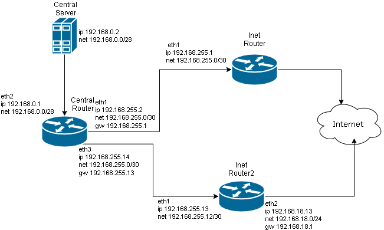

# IPTABLES



## Задание
Сценарии iptables  

1) реализовать knocking port  
- centralRouter может попасть на ssh inetrRouter через knock скрипт  
2) добавить inetRouter2, который виден(маршрутизируется (host-only тип сети для виртуалки)) с хоста или форвардится порт через локалхост  
3) запустить nginx на centralServer  
4) пробросить 80й порт на inetRouter2 8080  
5) дефолт в инет оставить через inetRouter  
  
* реализовать проход на 80й порт без маскарадинга  
## Настройка стенда
Настройка стенда выполняется машиной provision  
ansible-playbook [filtering.yml](filtering.yml)  

для доступа к другим машинам необходим доступ на адресе хоста 192.168.18.1  
к TCP портам: 30022, 31022, 32022, 33022  
## Knocking port
port knocking реализуется набором правил [iptables](iptables.knock)  
для адресов из 192.168.255.0/24  
1)  при обращении к порту 33333/TCP адрес источника добавляется в список SSH1  
2)  обращение к порту 22222/TCP от адреса из списка SSH1 переводит  
   в цепочку INPUTSSH1 и добавляет источник в список SSH2  
3) обращение к порту 11111/TCP от адреса из списка SSH2 переводит  
   в цепочку INPUTSSH2 и добавляет источник в список SSH3  
4) доступ к порту 22/TCP из списка SSH3 разрешен  
```bash
-A INPUT -s 192.168.255.0/24 -j TRAFFIC
-A TRAFFIC -p icmp --icmp-type any -j ACCEPT
-A TRAFFIC -m state --state NEW -m tcp -p tcp --dport 22 -m recent --rcheck --seconds 30 --name SSH3 -j ACCEPT

-A TRAFFIC -m state --state NEW -m tcp -p tcp -m recent --name SSH3 --remove -j DROP

-A TRAFFIC -m state --state NEW -m tcp -p tcp --dport 11111 -m recent --rcheck --name SSH2 -j INPUTSSH2
-A TRAFFIC -m state --state NEW -m tcp -p tcp -m recent --name SSH2 --remove -j DROP

-A TRAFFIC -m state --state NEW -m tcp -p tcp --dport 22222 -m recent --rcheck --name SSH1 -j INPUTSSH1
-A TRAFFIC -m state --state NEW -m tcp -p tcp -m recent --name SSH1 --remove -j DROP

-A TRAFFIC -m state --state NEW -m tcp -p tcp --dport 33333 -m recent --name SSH1 --set -j DROP
-A INPUTSSH1 -m recent --name SSH2 --set -j DROP
-A INPUTSSH2 -m recent --name SSH3 --set -j DROP 
-A TRAFFIC -j DROP
```
скрипт [knock.sh](knock.sh) использует утилиту nmap в цикле для обращения к портам хоста  
демонстрация работы:  
```bash
[root@centralRouter opt]# ssh 192.168.255.1
^C
[root@centralRouter opt]# ./knock.sh 192.168.255.1 33333 22222 11111

Starting Nmap 6.40 ( http://nmap.org ) at 2020-04-07 18:05 UTC
Warning: 192.168.255.1 giving up on port because retransmission cap hit (0).
Nmap scan report for 192.168.255.1
Host is up (0.00032s latency).
PORT      STATE    SERVICE
33333/tcp filtered unknown
MAC Address: 08:00:27:AB:51:08 (Cadmus Computer Systems)

Nmap done: 1 IP address (1 host up) scanned in 0.18 seconds

Starting Nmap 6.40 ( http://nmap.org ) at 2020-04-07 18:05 UTC
Warning: 192.168.255.1 giving up on port because retransmission cap hit (0).
Nmap scan report for 192.168.255.1
Host is up (0.00032s latency).
PORT      STATE    SERVICE
22222/tcp filtered unknown
MAC Address: 08:00:27:AB:51:08 (Cadmus Computer Systems)

Nmap done: 1 IP address (1 host up) scanned in 0.18 seconds

Starting Nmap 6.40 ( http://nmap.org ) at 2020-04-07 18:05 UTC
Warning: 192.168.255.1 giving up on port because retransmission cap hit (0).
Nmap scan report for 192.168.255.1
Host is up (0.00032s latency).
PORT      STATE    SERVICE
11111/tcp filtered vce
MAC Address: 08:00:27:AB:51:08 (Cadmus Computer Systems)

Nmap done: 1 IP address (1 host up) scanned in 0.18 seconds
[root@centralRouter opt]# ssh 192.168.255.1
root@192.168.255.1's password: 
Last login: Tue Apr  7 18:03:04 2020 from 192.168.255.2
[root@inetRouter ~]# 
```

## NAT

проброс порта реализуется через 2 правила в цепочке nat,  
т.к. маршрут по умолчанию для хоста centralServer пойдет через inetRouter,  
а проброс по заданию делается на хосте inetRouter2

1) в PREROUTING подмена адреса и порта назначения  
2) в POSTROUTING подмена адреса источника на маршрутизируемый адрес внутри сети  

```bash
-A PREROUTING -d 192.168.18.13 -p tcp -m tcp --dport 8080 -j DNAT --to-destination 192.168.0.2:80
-A POSTROUTING -s 192.168.18.0/24 -d 192.168.0.2 -p tcp -m tcp --dport 80 -j SNAT --to-source 192.168.255.13
```

nginx с centralServer отвечает с адреса inetRouter2
```bash
[root@centos7 ~]# curl 192.168.18.13:8080
<!DOCTYPE HTML PUBLIC "-//W3C//DTD HTML 4.01 Transitional//EN">
<html>
<head>
  <title>Welcome to CentOS</title>
  <style rel="stylesheet" type="text/css"> 
```
